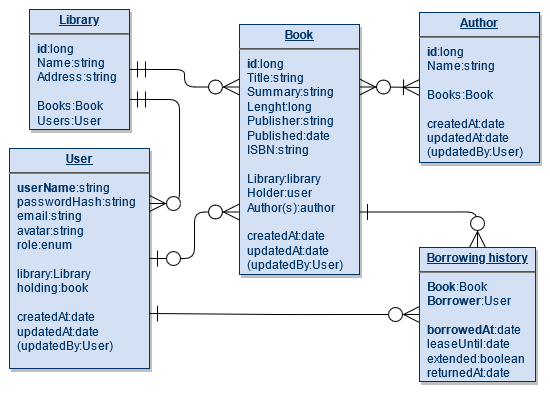

# Könyvtári nyilvántartó alkalmazás

Az alkalmazás az alább látható adatstruktúrára épül.

TODO:update pic if changed

### 1 Objektum készítési kényszerek

1.1 Az alkalmazással fel lehet venni szerzőket, könyveket és felhasználókat. Felhasználók lehetnek ügyfelek vagy
könyvtárosok, megfelelő alkalmazásbeli jogkörrel.

1.2 Könyvet csak már létező szerző(k)höz és tulajdonos könyvtárhoz rendelve lehet felvenni.

1.3 Felhasználót csak már létező könyvtárhoz rendelve lehet felvenni.

### 2 Kölcsönzés funkció leírása

A felhasználók ki tudnak kölcsönözni könyveket a könyvtárból, ilyenkor az alkalmazásban a könyvhöz hozzárendeljük azt a
felhasználót aki kikölcsönözte, valamint megadjuk, hogy meddig tart kölcsönzés.

A kölcsönzéskor létrejön egy bejegyzés a kölcsönzési történetben.

A kölcsönzés végét jelző "leaseUntil" mező változtatható.

Amikor visszakerül a könyv, akkor kitöltésre kerül a "returnedAt" mező.

### 3 Kölcsönzésre vonatkózó kényszerek

Egy felhasználó maximum 5 könyvet vehet ki egyszerre, valamint nem vehet ki új könyvet amíg van nála lejárt kölcsönzési
idejű könyv.

Egy könyvet maximum 1 hónapra lehet kölcsönözni, ami az ügyfél által egyszer hosszabbítható meg 1 héttel.

### 4 Csak könyvtárosok által eléhető funkciók:

- Létrehozási, olvasási, frissítési és törlési műveletek minden objektumra (ügyfelekre vonatkozó megkötések nélkül)
- Kölcsönzés lezárása

### 5 Ügyfelek részére is elérhető funkciók:

- Kölcsönzés indítása (maximum 1 hónapra)
- Kölcsönzés meghosszabbítása (kölcsönzésenként egyszer maximum 1 héttel)
- Publikus és saját információk olvasása